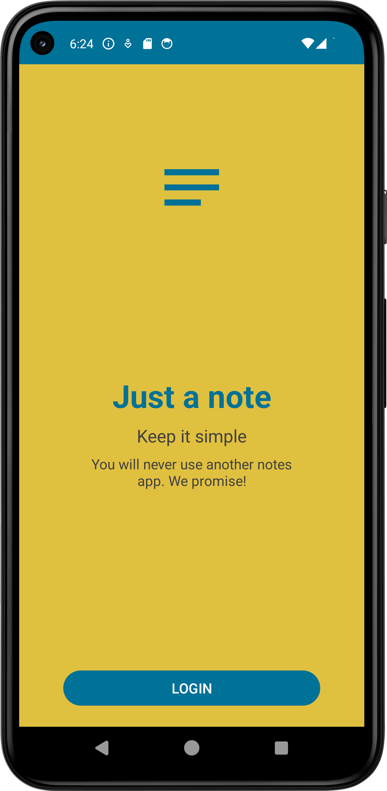

# D11 - App development and implementation - DDB 2022

## Just another notes app

Android app with room database.
Developed by EP and EH.

### Database

The database contains a list of entries with the following:

- description
- photo
- location

It is possible to create, edit and delete entries in the app.

### GUI

There are no specifications for the GUI

### Features

- App starts and displays GUI
- App displays list of database entries
- Database entries can be managed (insert, update, delete)
- App saves the location (latitude, longitude)
- App saves images in the database
- Click on database entry to open detailed view of the respective entry

Own functionalities:

- Shortcut for add a new note
- Share a saved note

