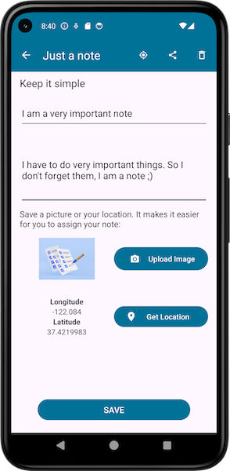
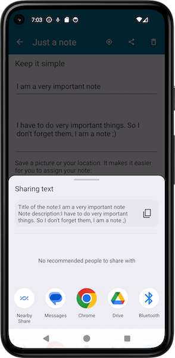
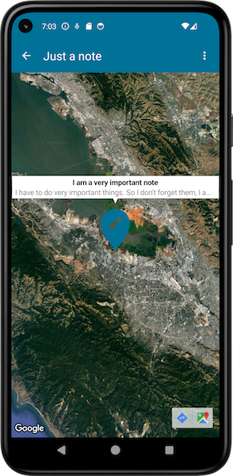

# Just a(nother) notes app

A notes app that saves images and GPS data in addition to text entries.

## App Overview

## Project specifications

Android app with room database.

The database contains a list of entries with the following:

- description
- photo
- location

It is possible to create, edit and delete entries in the app.

There are no specifications for the GUI.

### Features

- App starts and displays GUI
- App displays list of database entries
- Database entries can be managed (insert, update, delete)
- App saves the location (latitude, longitude)
- App saves images in the database
- Click on database entry to open detailed view of the respective entry

### Additional functionalities:

- App shortcut for add a new note
- Send simple data to other apps with Android Sharesheet
- The stored location can displayed on GoogleMaps
- "Swipe to delete"

## How to run "Just another notes app"

1. Clone the repository.
2. Open the whole project in Android Studio.
3. Replace YOUR_API_KEY with your own API key.
4. Sync & Run app configuration.

### Note on Google Maps

The Secrets Gradle plug-in was used to store the API key for Google Maps. It reads secrets such as
API keys from attribute files that are not checked into a version management system.

To be able to use the project, you must store your own Google Maps API key.

Open the secrets.properties file in the top-level directory of your project.
_Note: If the secrets.properties file does not exist, create it in the same folder as the
local.properties file._

Insert the following code, replacing YOUR_API_KEY with your own API key: `MAPS_API_KEY=YOUR_API_KEY`

## About the build

### Test and development environment

Deloped with Android Studio Hedgehog.
Tested with emulated Pixel 5 Android 14.0 ("UpsideDownCake") and a live device.

Properties
avd.ini.displayname              Pixel 5 API 34
avd.ini.encoding                 UTF-8
AvdId                            Pixel_5_API_34
disk.dataPartition.size          6442450944

### SDK

minSdk = 24
targetSdk = 34
compileSdk = 34

### Gradle-Plugins

* com.android.application: This plugin is used to create the Android app.
* org.jetbrains.kotlin.android: This is the Kotlin plugin for Android.
* kotlin-kapt: This plugin is responsible for the Kotlin Annotation Processing Tool.
* com.google.android.libraries.mapsplatform.secrets-gradle-plugin: Responsible for handling API keys
  and secret data.

### Dependencies

* androidx.room:room-ktx:2.5.2: Android Room Database
* androidx.room:room-compiler:2.5.2: Annotation Processor for Room
* androidx.core:core-ktx:1.12.0: Kotlin Addons
* androidx.appcompat:appcompat:1.6.1: GUI
* com.google.android.material:material:1.11.0: Material Design Components Library from Google
* androidx.constraintlayout:constraintlayout:2.1.4: Layout
* com.google.android.gms:play-services-maps:18.0.2: Google Maps Integration
* "com.google.android.gms:play-services-location:21.0.1" Geo Location Services
* junit:junit:4.13.2: Test Framework
* androidx.test.ext:junit:1.1.5: AndroidX Test Framework for JUnit
* androidx.test.espresso:espresso-core:3.5.1: Framework for UI Tests

## Developed by

Edwin Pichler, Erik Handler, Michael Tausch

## Image Credits

Images used in the screenshots to illustrate the image upload:

[Image by kstudio on Freepik](https://www.freepik.com/free-photo/untidy-pile-various-colors-sticky-post-notes-with-pushpin-isolated-white_2571689.htm#query=notes&from_query=notizen&position=20&from_view=search&track=sph&uuid=49ef48b9-8a77-4264-8d61-419ecb6faa60)
[Image by upklyak on Freepik](https://www.freepik.com/free-photo/3d-illustration-pen-putting-blue-ticks-paper_33062183.htm#query=notes&from_query=notizen&position=22&from_view=search&track=sph&uuid=49ef48b9-8a77-4264-8d61-419ecb6faa60)
[Image by rawpixel.com on Freepik](https://www.freepik.com/free-photo/forget-notice-reminder-words-graphic-concept_16436707.htm#query=notes&from_query=notizen&position=6&from_view=search&track=sph&uuid=05661dc2-0fcf-4ac5-b377-9eefb82d4611)
