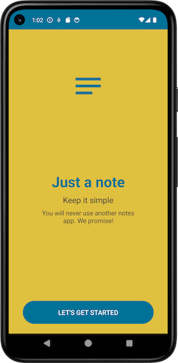

# Just a(nother) notes app

A notes app that saves images and GPS data in addition to text entries.

Developed by EP and EH.

## App Overview

## Project specifications

Android app with room database.

The database contains a list of entries with the following:

- description
- photo
- location

It is possible to create, edit and delete entries in the app.

There are no specifications for the GUI.

### Features

- App starts and displays GUI
- App displays list of database entries
- Database entries can be managed (insert, update, delete)
- App saves the location (latitude, longitude)
- App saves images in the database
- Click on database entry to open detailed view of the respective entry

### Additional functionalities:

- App shortcut for add a new note
- Send simple data to other apps with Android Sharesheet
- The stored location can displayed on GoogleMaps

## How to run "Just another notes app"

1. Clone the repository.
2. Open the whole project in Android Studio.
3. Sync & Run app configuration.
4. Replace YOUR_API_KEY with your own API key.

   
### Note on Google Maps

The Secrets Gradle plug-in was used to store the API key for Google Maps. It reads secrets such as
API keys from attribute files that are not checked into a version management system.

To be able to use the project, you must store your own Google Maps API key.

Open the secrets.properties file in the top-level directory of your project.
_Note: If the secrets.properties file does not exist, create it in the same folder as the
local.properties file._

Insert the following code, replacing YOUR_API_KEY with your own API key: `MAPS_API_KEY=YOUR_API_KEY`

## About the build

## SDK

minSdk = 24
targetSdk = 34
compileSdk = 34

### Gradle-Plugins

* com.android.application: This plugin is used to create the Android app.
* org.jetbrains.kotlin.android: This is the Kotlin plugin for Android.
* kotlin-kapt: This plugin is responsible for the Kotlin Annotation Processing Tool.
* com.google.android.libraries.mapsplatform.secrets-gradle-plugin: Responsible for handling API keys
  and secret data.

### Dependencies

* androidx.room:room-ktx:2.5.2: Android Room Database
* androidx.room:room-compiler:2.5.2: Annotation Processor for Room
* androidx.core:core-ktx:1.12.0: Kotlin Addons
* androidx.appcompat:appcompat:1.6.1: GUI
* com.google.android.material:material:1.11.0: Material Design Components Library from Google
* androidx.constraintlayout:constraintlayout:2.1.4: Layout
* com.google.android.gms:play-services-maps:18.0.2: Google Maps Integration
* junit:junit:4.13.2: Test Framework
* androidx.test.ext:junit:1.1.5: AndroidX Test Framework for JUnit
* androidx.test.espresso:espresso-core:3.5.1: Framework for UI Tests

### Import various classes needed for the app's functionality.
import android.Manifest
import android.annotation.SuppressLint
import android.content.Context
import android.content.DialogInterface
import android.content.Intent
import android.content.pm.PackageManager
import android.location.Location
import android.location.LocationListener
import android.location.LocationManager
import android.os.Bundle
import android.view.Menu
import android.view.MenuItem
import android.widget.Button
import android.widget.EditText
import android.widget.ImageView
import android.widget.TextView
import android.widget.Toast
import androidx.activity.result.contract.ActivityResultContracts
import androidx.appcompat.app.AlertDialog
import androidx.appcompat.app.AppCompatActivity
import androidx.core.app.ActivityCompat
import androidx.core.content.ContextCompat
import androidx.room.Room

### Import classes related to the app's database and utility functions.
import com.example.myapplication.dao.NoteDao
import com.example.myapplication.database.NotesDatabase
import com.example.myapplication.entities.Note
import com.example.myapplication.util.ImageConverter
import com.google.android.gms.location.FusedLocationProviderClient
import com.google.android.gms.location.LocationRequest
import com.google.android.gms.location.LocationServices
import com.google.android.gms.tasks.CancellationToken
import com.google.android.gms.tasks.CancellationTokenSource
import com.google.android.gms.tasks.OnTokenCanceledListener
